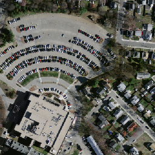
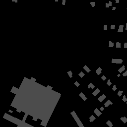

# Semantic-segmentation

### [这个repo适合新手入门pytorch和图像分割]()
一个采用**Pytorch**的语义分割项目

这个repo是在遥感图像语义分割项目时写的，但数据集不是我们遥感项目的数据集，而是网上download的一个遥感数据集。 

### [实验结果]()





## 我的环境

- windows10
- Anaconda 3
- pytorch 1.0
- tensorflow tensorboard tensorboardX (用于可视化)

## 如何运行

### 所有的相对路径均在代码中配置

- 打开终端，输入  
```
python train_Seg.py
```  
- 调用Segnet
- 或者  
```
python train_U.py
```  
- 调用Unet
- 或者  
```
python predict.py
```  
- 进行推断inference（需要有已经训练好的模型才可以推断）

## 包含文件
###  [train_Seg.py](train_Seg.py)
* 调用Segnet进行训练网络
* 主函数
###  [train_Unet.py](train_Unet.py)

* 调用Unet进行训练网络
* 主函数
###  [predict.py](predict.py)

* 对模型进行inference预测

###  [models/seg_net.py](seg_net.py)

* Segnet网络定义

###  [models/u_net.py](u_net.py)

* Unet网络定义

###  [utils/DataArgument.py](DataArgument.py)

* 数据预处理文件，对数据切割，旋转加噪顺便做数据增强

## 数据集  

### 数据集下载
[https://www.cs.toronto.edu/~vmnih/data/](https://www.cs.toronto.edu/~vmnih/data/)


### 数据集处理
进入utils文件夹，使用下面语句（相对路径要提前配置好） 

```
python DataArgument.py
```  

**DataArgument.py**实现了对大图进行切割（成256 x 256），切割后旋转，加噪声等操作来生成训练数据。


## 联系我
### 代码运行过程中有任何问题，都可随时联系我（for free and u feel free to contack me please），可以在issue中提问，我也会尽快回答。


